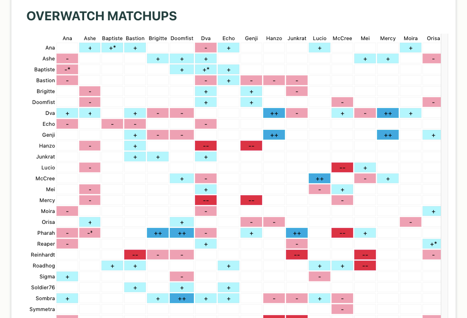

# Hero Matchups Api Documentation Website

This is the home to the Hero Matchups API documentation website. The Hero Matchups API is a resource that offers strategic counters & opponent matchups for the team based multiplayer first-person shooter Overwatch 2. 

### Features
* Hero matchup chart - Including all strong and weak matchups for each character based on hero kits, the latest competitive season and win rates 
* Random hero picker - Receive a random hero. Choose between tank, damage or support 
* Hero profile lookup - Check out individual hero counters and weak or strong matchups
* (Coming Soon) Line Up Analyzer - See strengths and weaknesses of selected line-ups 

Check out the website at https://heromatchups.com (or https://hero-pick-app.web.app/)

API repo: github.com/Sleighs/hero-matchup-api

